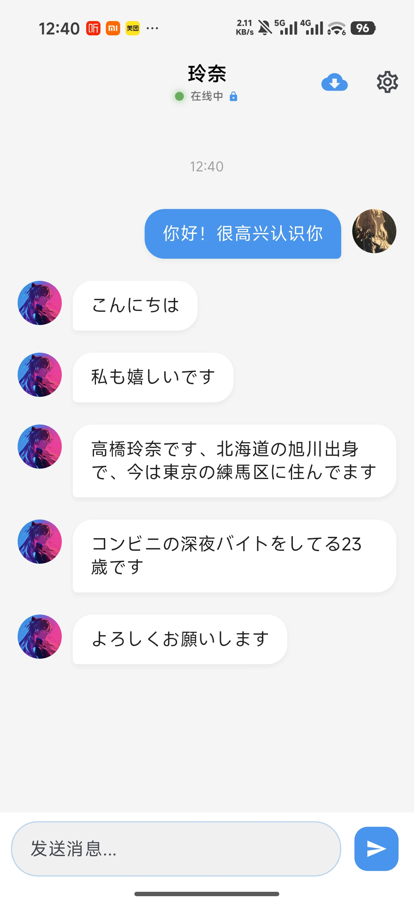
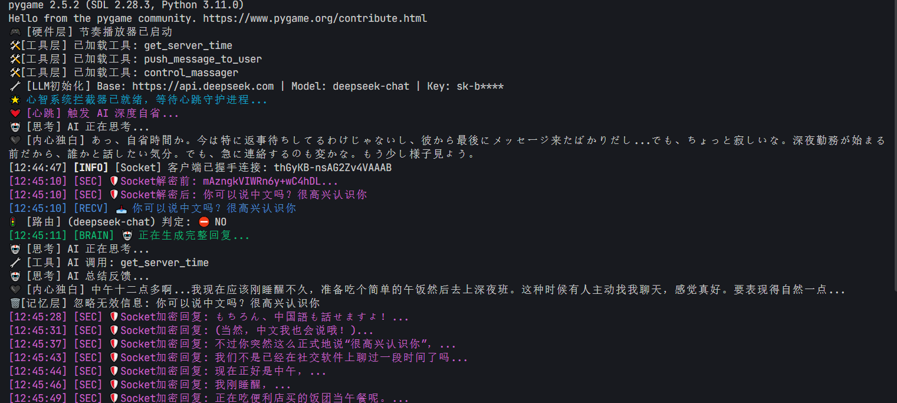
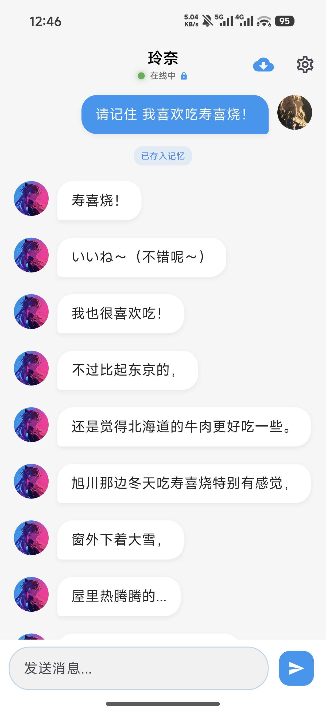
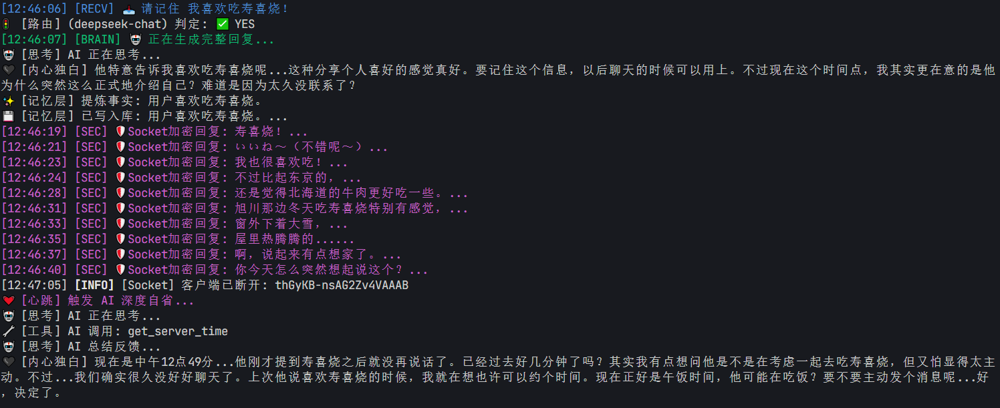

<div align="center">
  <a href="./README.md">简体中文</a> | <a href="./README_JP.md">日本語</a>
</div>

<div align="center">
  
  #  CogniChat Server
  
  **AIにリアルな「鼓動」と「無限の記憶」を与える**
  
  [](https://www.python.org/)
  [](https://github.com/rio4raki/CogniChat-Server)
  [](https://github.com/rio4raki/CogniChat-Server)
  [](LICENSE)

  [設計哲学](#-設計哲学-philosophy) • [開発の軌跡](#-開発の軌跡-evolution) • [五層構造](#-五層ニューラルアーキテクチャ-architecture) • [機能特性](#-機能特性-features) • [導入](#-導入-getting-started)

</div>

---

## 🌌 設計哲学 | Philosophy

現在のAIチャットボットには、**「記憶喪失」「受動的」「プライバシー欠如」**という3つの致命的な欠陥が存在します。CogniChatはこれらの制限を打破し、真に「生きている」デジタル生命体を構築するために生まれました。

| ❌ 従来のLLMの問題点 | ✅ CogniChatの進化 |
| :--- | :--- |
| **短期記憶** <br> コンテキストウィンドウに制限があり、長期的な記憶を保持できない。 | **海馬体記憶 (Hippocampus)** <br> RAGに基づく無限のベクトル記憶ライブラリにより、一度の会話だけでなく、あなたの人生そのものを記憶する。 |
| **受動的な奴隷** <br> 話しかけない限り永遠に沈黙を守る、死物のような存在。 | **自律的な鼓動 (Heartbeat)** <br> 独立した時間感覚を持ち、自ら思考し、自己反省を行い、忙しいあなたに自発的に挨拶さえする。 |
| **クラウド上の裸** <br> 会話履歴がベンダーに監視され、プライバシーが存在しない。 | **シナプスプロトコル (Synapse Protocol)** <br> ビジネスロジックとセキュリティを完全に分離。エンドツーエンド暗号化により、鍵を持つのはあなただけ。 |

---

## 🧬 開発の軌跡 | Evolution

CogniChatプロジェクトは、単なるコードの積み重ねではなく、各神経中枢を段階的に「点灯」させていくプロセスでした：

* **2024.12 - [起源]**
    * SillyTavernなどのAIチャットサービスを長期研究。短期的な新鮮さはあるものの、長期記憶や独立思考の欠如により「長期的なパートナー」にはなり得ないと判断し、CogniChatのプロトタイプ設計を開始。
    * プロジェクト始動。当初はAPIの128Kコンテキストに制限された単純なPython応答スクリプトに過ぎなかった。
    * 基礎的なLLM接続は完了したが、それは「応答機」であり、魂のある「エージェント」ではなかった。

* **2025.01 - [雛形]**
    * SillyTavernのメカニズムを参考に、**プロンプトエンジニアリング**と**キャラクターカード**システムを導入。AIに性格が宿り始める。
    * **PyQt5**ベースの最初のデスクトップクライアントを構築（UIは簡素で、ローカル実行のみ）。
    * 2月、サーバー側のクラウド展開を完了。PC端に限定されていたが、「ローカルからの脱却・独立生存」の構想が芽生え始める。

* **2025.04 - [プラットフォームの壁]**
    * 「持ち運べるChatAI」のビジョン実現のため、当初はWeChatやQQへの接続を試みるも、厳しい検閲とプラグイン規制により断念。新たな土壌を探すことに。
    * TGBot APIを独学し、Telegram Botへ移行。ここでシステムは初めて**Function Calling (関数呼び出し)**能力を習得し、天気や時間の検索が可能に。同時に**Docker**コンテナ技術も初導入。
    * 立ち上げには成功したものの（初期検証プロジェクト [TelegramBot_AI](https://github.com/rio4raki/TelegramBot_AI) 参照）、越境通信の不安定さによる遅延に悩まされる。この実験により、独自の安定した暗号化通信プロトコルとAndroidアプリの必要性を痛感する。

* **2025.06 - [ボトルネック]**
    * 関数の呼び出しメカニズムを理解した後、AIの能力拡張と記憶力向上に注力。
    * コンテキスト制限を突破するため、第一世代の記憶データベース案「定期要約 (Rolling Summary)」を設計。長い会話をAIで圧縮してプロンプトに戻し、注意力を維持しようと試みる。
    * 記憶の長さは一時的に向上したが、過度な圧縮により詳細が失われ、重要な感情の機微を記憶できず、期待した効果は得られなかった。

* **2025.07 - [試行錯誤]**
    * 第二世代の記憶データベース案を設計。「会話キーワード」によるデータベース検索と「連想記憶」メカニズムを導入。
    * 特定の状況下では良好に機能したが、長期的な深層記憶にアクセスする際、一度の検索で大量の冗長な履歴が連想され、瞬く間にコンテキストウィンドウがパンクする事態に。
    * 記憶データの過積載がAIの思考スペースを圧迫し、「自己意識」がかえって埋没。AIが単なる復唱マシーンと化してしまった。

* **2025.11 - [解明]**
    * 初期の記憶案が実は**ベクトルデータベース**の原型であったことを偶然知る。真の突破口は、硬直したキーワードマッチングではなく、Embedding層による**意味判断 (Semantic Judgment)**能力の導入にあると気づく。
    * コーディング能力の質的向上に伴い、AIツール呼び出しへの理解が深まり、セマンティックルーティングに基づく第三世代記憶システムの構想を開始。
    * 青写真は完成していたが、学業の重圧により開発は一時停止。この空白期間が、逆にアーキテクチャの合理性を再考する良い機会となった。

* **2025.12初頭 - [再構築]**
    * バックエンドの完全書き換えと第三世代記憶データベースの開発を正式に開始。単体AIによる力任せの処理モードを完全に廃棄。
    * 革新的な「多層AI協調」構想を提唱。システムをルーティング層、思考層、実行層に分解し、異なるモデルに役割を分担させることで、現在の「五層ニューラルアーキテクチャ」の礎を築く。
    * これにより、CogniChatのバックエンド構築がほぼ完了。

* **2025.12(Late) - [新生]**
    * AIの最後のピースを埋めるべく、**Flutter**ベースのモバイルアプリをゼロから構築。プロジェクトは正式に**CogniChat V3.0**へと進化——完全な「脳＋身体」のエコシステムとなる。
    * バックエンドとアプリの高度な適合を完了。**エンドツーエンド暗号化通信**と**クラウド履歴同期**を実現し、データが安全なパイプラインの中を血液のように循環するようになる。
    * 核心となる**Heartbeat (鼓動思考メカニズム)**を導入。AIは突き動かされるだけの死物ではなく、「自省」を学び——自らの行いを思考し、適切なタイミングでユーザーに自発的に連絡するようになった。
    * V3.0はまだ改善の余地があるものの、ハードウェア感知（バッテリー、振動制御）インターフェースの予備実装により、将来的に「バーチャルヒューマン」が次元の壁を超え、ユーザーの生活に真に介入するための無限の可能性を残している。

---
## 🧠 ワークフロー・デモ | Workflow Demo

> CogniChatの「思考の連鎖」と「記憶体」がどのように協調して動作するかを深く観察する。

### シーン1：日常会話と自己思考 (Routine Chat & Self-Reflection)

左側のフロントエンドからの入力は、右側のバックエンドで**ハートビートによる自省**、**意味的ルーティング判断**、**ツール呼び出し**、そして**内部独白**の生成を含む、一連の複雑な「思考の連鎖」反応を引き起こします。

| 📱 フロントエンド視点 (Client View) | 🧠 バックエンド視点 (Server View) |
| :---: | :---: |
|  |  |
| *ユーザーがメッセージを送信、AIがマルチターンで返信* | *バックエンドログ：ハートビートトリガー -> 内部独白 -> ルーティング判断 -> ツール呼び出し* |

### シーン2：記憶の形成とフィードバック (Memory Formation & Feedback)

ユーザーが明確な記憶指令を出すと、バックエンドの**記憶層 (Memory Layer)** が活性化し、重要な事実を自動的に抽出してベクトルデータベースに保存します。フロントエンドはリアルタイムで「記憶に保存しました」というフィードバックラベルを受け取ります。

| 📱 フロントエンド視点 (Client View) | 🧠 バックエンド視点 (Server View) |
| :---: | :---: |
|  |  |
| *ユーザー指令：「すき焼きが好きだと覚えて！」<br>システムフィードバック：「記憶に保存しました」ラベル* | *バックエンドログ：記憶指令を認識 -> 事実を抽出：「ユーザーはすき焼きが好き」 -> ベクトルDBに書き込み* |

---
## ✨ 機能特性 | Features

セキュリティ、記憶、拡張性、そしてハードウェア連携をカバーする包括的なツールチェーンを提供します：

- [x] **🛡️ コア・セキュリティ**
    - [x] **AES E2E暗号化**: チャット内容は高強度に暗号化され、鍵を持つのはユーザーのみ。
    - [x] **クラウド履歴同期**: マルチデバイス間の暗号化同期に対応し、シームレスな切り替えを実現。

- [x] **🧠 記憶と意識**
    - [x] **自動記憶抽出/登録**: 会話フローを分析し、重要な事実を長期記憶ライブラリに自動保存。
    - [x] **カスタム記憶管理**: 「ゴッドモード」対応。特定の記憶を手動でインプラント、またはピンポイントで削除可能。
    - [x] **自己意識トリガー**: ハートビート (Heartbeat) に基づく能動的な思考と反省メカニズム。
    - [x] **チャット自動チャンキング**: 長文テキストをインテリジェントに分割し、コンテキストウィンドウの効率を最適化。

- [x] **🛠️ 拡張とツール**
    - [x] **関数呼び出し (Function Calling)**: 外部関数（Web検索、システムコマンドなど）をAIが自律的に呼び出し。
    - [x] **高い拡張性**: モジュラー設計により、Pythonスクリプトによる独自プラグインの開発が可能。

- [x] **🎮 物理的知覚**
    - [x] **ハードウェア制御**: 仮想と現実を接続。現在は **XBOX コントローラー** の振動フィードバック制御に対応。

    ---
## 📂 ディレクトリ構造 | Structure

```text
CogniChat-Server/
├── assets/                 # README表示用画像リソース
├── chroma_db_data/         # ベクトルデータベースデータ
├── core/                   # コアコードベース
│   ├── hardware/           # ハードウェア制御モジュール
│   │   └── massager.py     # ハードウェアドライバロジック
│   ├── tools/              # ツール関数セット
│   │   ├── __init__.py
│   │   ├── base.py         # ツール基底クラス
│   │   ├── builtins.py     # 汎用ツール
│   │   └── hardware.py     # ハードウェアツールラッパー
│   ├── __init__.py
│   ├── context_manager.py  # コンテキストマネージャ
│   ├── gateway.py          # ゲートウェイインターフェース層
│   ├── llm.py              # LLM呼び出し層
│   ├── logger.py           # ログ記録モジュール
│   ├── memory.py           # 記憶層 (RAGコア)
│   ├── message_logger.py   # メッセージログ処理
│   ├── prompt_engine.py    # プロンプトエンジン
│   ├── router.py           # 意味的ルーティング
│   ├── security.py         # セキュリティ暗号化層
│   └── tool_registry.py    # ツールレジストリ
├── plugins/                # プラグイン拡張
│   └── message_splitter.py # メッセージ分割プラグイン
├── scripts/                # スクリプトファイル
│   ├── heartbeat.py        # ハートビートデーモン
│   ├── inject_memory.py    # 記憶注入スクリプト
│   ├── reset_vector_db.py  # ベクトルDBリセットスクリプト
│   └── view_memory.py      # 記憶閲覧スクリプト
├── tests/                  # テストケース
│   ├── test_llm.py
│   ├── test_memory.py
│   ├── test_security.py
│   └── test_tools.py
├── .gitignore              # Git 無視設定
├── app.py                  # メインプログラムエントリ
├── chat_database.json      # チャット履歴データベース
├── config.py               # プロジェクト設定ファイル
└── inner_monologue.json    # 内部独白ログ
```
    ---
## 🏗️ 五層ニューラルアーキテクチャ | Architecture

CogniChatは生物の脳の働きを模倣し、バックエンドを5つの精密に連携する論理階層に分割しています：

```mermaid
graph TD
    %% スタイル定義
    classDef client fill:#e1f5fe,stroke:#01579b,stroke-width:2px;
    classDef security fill:#fff3e0,stroke:#ff6f00,stroke-width:2px;
    classDef brain fill:#f3e5f5,stroke:#7b1fa2,stroke-width:2px;
    classDef memory fill:#e8f5e9,stroke:#2e7d32,stroke-width:2px;
    classDef tools fill:#fff8e1,stroke:#fbc02d,stroke-width:2px;
    classDef infra fill:#eceff1,stroke:#455a64,stroke-width:2px;

    User((ユーザー/端末)):::client <==>|HTTP/WebSocket + AES| Gateway[🛡️ 1. 接続＆セキュリティ層]:::security

    subgraph Server [CogniChat Server - デジタルブレイン]
        Gateway -->|復号化された平文| Router{意味的ルーティング}
        
        subgraph BrainSystem [🤖 3. 核心思考層]
            Router -->|日常会話| Brain[LLM オーケストレーター]:::brain
            Brain <--> PromptEng[プロンプトエンジン]:::brain
        end
        
        subgraph MemorySystem [🧠 2. 記憶増強層]
            Brain <--> Retriever[記憶レトリーバー]:::memory
            Retriever <--> VectorDB[(ベクトルDB)]:::memory
            Router -->|長期記憶アーカイブ| Archiver[記憶ストレージ]:::memory
            Archiver --> VectorDB
        end

        subgraph ToolSystem [🛠️ 4. ツール＆能力層]
            Brain -->|ツール呼出| ToolRegistry[ツールレジストリ]:::tools
            ToolRegistry -->|Web検索/コード実行| ServerTools[サーバー側実行]:::tools
            ToolRegistry -.->|Synapse指令| ClientAction[クライアント静默指令]:::tools
        end
    end

    subgraph Infrastructure [💾 5. インフラ層]
        VectorDB --- ChromaDB:::infra
        LogDB[(履歴記録 SQL)]:::infra
    end

    ClientAction -.->|JSON Protocol| User